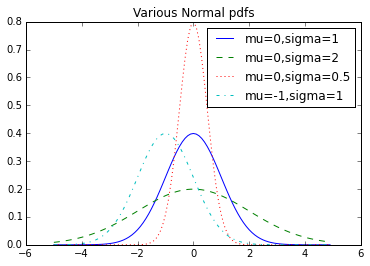
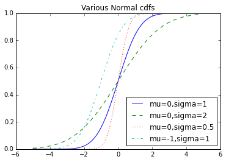

## Chapter 6. Probability
- The laws of probability, so true in general, so fallacious in particular. by Edward Gibbon
- Notationally, we write P(E) to mean “the probability of the event E.”

### Dependence and Independence
- Roughly speaking, we say that two events E and F are dependent if knowing something about whether E happens gives us information about whether F happens (and vice versa). Otherwise they are independent.

- P(E, F) = P(E) * P(F)

### Conditional Probability

- P(E, F) = P(E) * P(F)
- P(E l F) = P(E, F) / P(F)
- P(E, F) = P(E l F) * P (F)
- P(E l F) = P(E) // E and F are independent

1. Each child is equally likely to be a boy or a girl
2. The gender of the second child is independent of the gender of the first child

- Now we can ask what is the probability of the event “both children are girls” (B) conditional on the event “the older child is a girl” (G)?

- P (B l G) = P(B, G) / P(G) = P(B) / P(G) = 1/2

- We could also ask about the probability of the event “both children are girls” conditional on the event “at least one of the children is a girl” (L). Surprisingly, the answer is different from before! As before, the event B and L (“both children are girls and at least one of the children is a girl”) is just the event B. This means we have:

- P (B l L) = P(B,L) / P(L) = P(B) / P(L) = 1/3

    def random_kid():
        return random.choice(["boy", "girl"])

    both_girls = 0
    olrder_girl = 0
    either_girl = 0

    import random
    random.seed(0)

    if __name__ == "__main__":
        #
        # CONDITIONAL PROBABILITY
        #
        both_girls = 0
        older_girl = 0
        either_girl = 0
        random.seed(0)
        for _ in range(10000):
            younger = random_kid()
            older = random_kid()
            if older == "girl":
                older_girl += 1
            if older == "girl" and younger == "girl":
                both_girls += 1
            if older == "girl" or younger == "girl":
                either_girl += 1

    from __future__ import division
    from collections import Counter
    import math, random

    print "P(both | older):", both_girls / older_girl 

    P(both | older): 0.514228456914
    

    print "P(both | either): ", both_girls / either_girl

    P(both | either):  0.341541328364
    

### Bayes's Theorem

- P(E l F) = P(E,F) / P(F) = P(F l E) P(E) / P(F)
- P(F) = P(F,E) + P(F, ㄱE)
- P(E l F) = P(F l E) P(E) / [P(FlE)P(E) + P(FlㄱE)/P(ㄱE)]
- This theorem often gets used to demonstrate why data scientists are smarter than doctors. Imagine a certain disease that affects 1 in every 10,000 people. And imagine that there is a test for this disease that gives the correct result (“diseased” if you have the disease, “nondiseased” if you don’t) 99% of the time.
- What does a positive test mean? Let’s use T for the event “your test is positive” and D for the event “you have the disease.” Then Bayes’s Theorem says that the probability that you have the disease, conditional on testing positive, is:
- P(D l T) = P(T l D) P(D) / [P(T l D) P(D) + P(T l ㄱD)P(ㄱD)]

### Random Variables
- A random variable is a variable whose possible values have an associated probability distribution.
- A very simple random variable equals 1 if a coin flip turns up heads and 0 if the flip turns up tails. A more complicated one might measure the number of heads observed when flipping a coin 10 times or a value picked from range(10) where each number is equally likely.

- We will sometimes talk about the expected value of a random variable, which is the average of its values weighted by their probabilities. The coin flip variable has an expected value of 1/2 (= 0 * 1/2 + 1 * 1/2), and the range(10) variable has an expected value of 4.5.

### Continuous Distributions
- A coin flip corresponds to a discrete distribution 
- Often we’ll want to model distributions across a continuum of outcomes.
- Because there are infinitely many numbers between 0 and 1, this means that the weight it assigns to individual points must necessarily be zero. For this reason, we represent a continuous distribution with a probability density function (pdf) such that the probability of seeing a value in a certain interval equals the integral of the density function over the interval.

    def uniform_pdf(x):
        return 1 if x >= 0 and x < 1 else 0

    random.random()

    0.21973714158949476

    def uniform_cdf(x):
        "returns the probability that a uniform random variable is <= x"
        if x < 0: return 0 # uniform random is never less than 0
        elif x < 1: return x # e.g. P(X <= 0.4) = 0.4
        else: return 1 # uniform random is always less than 1

    def normal_pdf(x, mu=0, sigma=1):
        sqrt_two_pi = math.sqrt(2 * math.pi)
        return (math.exp(-(x-mu) ** 2 / 2 / sigma ** 2) / (sqrt_two_pi * sigma))

    from matplotlib import pyplot as plt
    %matplotlib inline

    #The Normal Distribution  : bell curve–shaped distribution
    xs = [x / 10.0 for x in range(-50, 50)]
    plt.plot(xs,[normal_pdf(x,sigma=1) for x in xs],'-',label='mu=0,sigma=1')
    plt.plot(xs,[normal_pdf(x,sigma=2) for x in xs],'--',label='mu=0,sigma=2')
    plt.plot(xs,[normal_pdf(x,sigma=0.5) for x in xs],':',label='mu=0,sigma=0.5')
    plt.plot(xs,[normal_pdf(x,mu=-1) for x in xs],'-.',label='mu=-1,sigma=1')
    plt.legend()
    plt.title("Various Normal pdfs")
    plt.show()

    def normal_cdf(x, mu=0,sigma=1):
        return (1 + math.erf((x - mu) / math.sqrt(2) / sigma)) / 2

    xs = [x / 10.0 for x in range(-50, 50)]
    plt.plot(xs,[normal_cdf(x,sigma=1) for x in xs],'-',label='mu=0,sigma=1')
    plt.plot(xs,[normal_cdf(x,sigma=2) for x in xs],'--',label='mu=0,sigma=2')
    plt.plot(xs,[normal_cdf(x,sigma=0.5) for x in xs],':',label='mu=0,sigma=0.5')
    plt.plot(xs,[normal_cdf(x,mu=-1) for x in xs],'-.',label='mu=-1,sigma=1')
    plt.legend(loc=4) # bottom right
    plt.title("Various Normal cdfs")
    plt.show()

    def inverse_normal_cdf(p, mu=0, sigma=1, tolerance=0.00001):
        """find approximate inverse using binary search"""
    
        # if not standard, compute standard and rescale
        if mu != 0 or sigma != 1:
            return mu + sigma * inverse_normal_cdf(p, tolerance=tolerance)
        
        low_z, low_p = -10.0, 0            # normal_cdf(-10) is (very close to) 0
        hi_z,  hi_p  =  10.0, 1            # normal_cdf(10)  is (very close to) 1
        while hi_z - low_z > tolerance:
            mid_z = (low_z + hi_z) / 2     # consider the midpoint
            mid_p = normal_cdf(mid_z)      # and the cdf's value there
            if mid_p < p:
                # midpoint is still too low, search above it
                low_z, low_p = mid_z, mid_p
            elif mid_p > p:
                # midpoint is still too high, search below it
                hi_z, hi_p = mid_z, mid_p
            else:
                break
    
        return mid_z

### The Central Limit Theorem
- One reason the normal distribution is so useful is the central limit theorem, which says (in essence) that a random variable defined as the average of a large number of independent and identically distributed random variables is itself approximately normally distributed. In particular, if are random variables with mean and standard deviation , and if n is large, then:

- https://ko.wikipedia.org/wiki/%EC%A4%91%EC%8B%AC%EA%B7%B9%ED%95%9C%EC%A0%95%EB%A6%AC

    def bernoulli_trial(p):
        return 1 if random.random() < p else 0

    def binomial(n, p):
        return sum(bernoulli_trial(p) for _ in range(n))

    def make_hist(p, n, num_points):
        data = [binomial(n, p) for _ in range(num_points)]
        # use a bar chart to show the actual binomial samples
        histogram = Counter(data)
        plt.bar([x - 0.4 for x in histogram.keys()],
                [v / num_points for v in histogram.values()],
                0.8,
                color='0.75')
        mu = p * n
        sigma = math.sqrt(n * p * (1 - p))
        # use a line chart to show the normal approximation
        xs = range(min(data), max(data) + 1)
        ys = [normal_cdf(i + 0.5, mu, sigma) - normal_cdf(i - 0.5, mu, sigma)
            for i in xs]
        plt.plot(xs,ys)
        plt.title("Binomial Distribution vs. Normal Approximation")
        plt.show()

    
