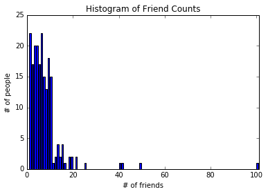
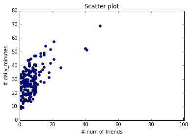
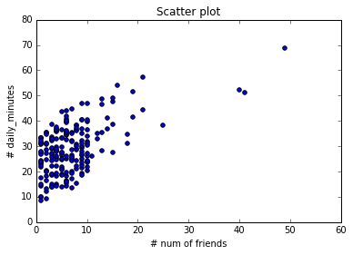

## Chapter 5. Statistics

- Facts are stubborn, but statistics are more pliable.

#### Describing a Single Set of Data


```python
num_friends = [100,49,41,40,25,21,21,19,19,18,18,16,15,15,15,15,14,14,13,13,13,13,12,12,11,10,10,10,10,10,10,10,10,10,10,10,10,10,10,10,9,9,9,9,9,9,9,9,9,9,9,9,9,9,9,9,9,9,8,8,8,8,8,8,8,8,8,8,8,8,8,7,7,7,7,7,7,7,7,7,7,7,7,7,7,7,6,6,6,6,6,6,6,6,6,6,6,6,6,6,6,6,6,6,6,6,6,6,5,5,5,5,5,5,5,5,5,5,5,5,5,5,5,5,5,4,4,4,4,4,4,4,4,4,4,4,4,4,4,4,4,4,4,4,4,3,3,3,3,3,3,3,3,3,3,3,3,3,3,3,3,3,3,3,3,2,2,2,2,2,2,2,2,2,2,2,2,2,2,2,2,2,1,1,1,1,1,1,1,1,1,1,1,1,1,1,1,1,1,1,1,1,1,1]
```


```python
from matplotlib import pyplot as plt
```


```python
%matplotlib inline
from __future__ import division
from collections import Counter
import math         
```


```python
friend_counts = Counter(num_friends)
```


```python
friend_counts
```


    Counter({1: 22,
             2: 17,
             3: 20,
             4: 20,
             5: 17,
             6: 22,
             7: 15,
             8: 13,
             9: 18,
             10: 15,
             11: 1,
             12: 2,
             13: 4,
             14: 2,
             15: 4,
             16: 1,
             18: 2,
             19: 2,
             21: 2,
             25: 1,
             40: 1,
             41: 1,
             49: 1,
             100: 1})


```python
xs = range(101)
ys = [friend_counts[x] for x in xs]
```


```python
xs
```


    range(0, 101)


```python
plt.bar(xs, ys)
plt.axis([0, 101, 0, 25])
plt.title("Histogram of Friend Counts")
plt.xlabel("# of friends")
plt.ylabel("# of people")
plt.show()
```





```python
num_points = len(num_friends)
```


```python
largest_value = max(num_friends)            # 100
smallest_value = min(num_friends)           # 1
```


```python
largest_value
```


    100


```python
smallest_value
```


    1


```python
sorted_values = sorted(num_friends)
```


```python
smallest_value = sorted_values[0]
second_smallest_value = sorted_values[1]
second_largest_value = sorted_values[-2]
```

### Central Tendencies


```python
def mean(x):
       return sum(x) / len(x)
```


```python
mean(num_friends)
```


    7.333333333333333


- We’ll also sometimes be interested in the median, which is the middle-most value (if the number of data points is odd) or the average of the two middle-most values (if the number of data points is even).

- Notice that — unlike the mean — the median doesn’t depend on every value in your data. For example, if you make the largest point larger (or the smallest point smaller), the middle points remain unchanged, which means so does the median.


```python
def median(v):
    n = len(v)
    sorted_v = sorted(v)
    midpoint = n // 2
    if n % 2 == 1:
        return sorted_v[midpoint]
    else:
        lo = midpoint - 1
        hi = midpoint
        return (sorted_v[lo] + sorted_v[hi]) / 2
```


```python
median(num_friends) 
```


    6.0


- At the same time, the mean is very sensitive to outliers in our data. If our friendliest user had 200 friends (instead of 100), then the mean would rise to 7.82, while the median would stay the same. If outliers are likely to be bad data (or otherwise unrepresentative of whatever phenomenon we’re trying to understand), then the mean can sometimes give us a misleading picture. 

- For example, the story is often told that in the mid-1980s, the major at the University of North Carolina with the highest average starting salary was geography, mostly on account of NBA star (and outlier) Michael Jordan.

- A generalization of the median is the quantile, which represents the value less than which a certain percentile of the data lies. (The median represents the value less than which 50% of the data lies.)


```python
def quantile(x, p):
    p_index = int(p * len(x))
    return sorted(x)[p_index]
```


```python
quantile(num_friends, 0.10) # 1
```


    1


```python
quantile(num_friends, 0.25) # 3
```


    3


```python
quantile(num_friends, 0.75) # 9
```


    9


```python
max_count = max(friend_counts.values())
```


```python
max_count
```


    22


```python
friend_counts.items()
```


    dict_items([(1, 22), (2, 17), (3, 20), (4, 20), (5, 17), (6, 22), (7, 15), (8, 13), (9, 18), (10, 15), (11, 1), (12, 2), (13, 4), (14, 2), (15, 4), (16, 1), (18, 2), (19, 2), (21, 2), (25, 1), (100, 1), (40, 1), (41, 1), (49, 1)])


```python
def mode(x):
    counts = Counter(x)
    max_count = max(counts.values())
    return [x_i for x_i, count in counts.items()
            if count == max_count]
```


```python
mode(num_friends) 
```


    [1, 6]


```python
def data_range(x):
       return max(x) - min(x)
```


```python
data_range(num_friends)
```


    99


```python
#measure of variability
def de_mean(x):
    x_bar = mean(x)
    return [x_i - x_bar for x_i in x]
```


```python
def variance(x):
    n = len(x)
    deviations = de_mean(x)
    return sum_of_squares(deviations) / (n - 1)
```


```python
de_mean(num_friends)
```


    [92.66666666666667,
     41.666666666666664,
     33.666666666666664,
     32.666666666666664,
     17.666666666666668,
     13.666666666666668,
     13.666666666666668,
     11.666666666666668,
     11.666666666666668,
     10.666666666666668,
     10.666666666666668,
     8.666666666666668,
     7.666666666666667,
     7.666666666666667,
     7.666666666666667,
     7.666666666666667,
     6.666666666666667,
     6.666666666666667,
     5.666666666666667,
     5.666666666666667,
     5.666666666666667,
     5.666666666666667,
     4.666666666666667,
     4.666666666666667,
     3.666666666666667,
     2.666666666666667,
     2.666666666666667,
     2.666666666666667,
     2.666666666666667,
     2.666666666666667,
     2.666666666666667,
     2.666666666666667,
     2.666666666666667,
     2.666666666666667,
     2.666666666666667,
     2.666666666666667,
     2.666666666666667,
     2.666666666666667,
     2.666666666666667,
     2.666666666666667,
     1.666666666666667,
     1.666666666666667,
     1.666666666666667,
     1.666666666666667,
     1.666666666666667,
     1.666666666666667,
     1.666666666666667,
     1.666666666666667,
     1.666666666666667,
     1.666666666666667,
     1.666666666666667,
     1.666666666666667,
     1.666666666666667,
     1.666666666666667,
     1.666666666666667,
     1.666666666666667,
     1.666666666666667,
     1.666666666666667,
     0.666666666666667,
     0.666666666666667,
     0.666666666666667,
     0.666666666666667,
     0.666666666666667,
     0.666666666666667,
     0.666666666666667,
     0.666666666666667,
     0.666666666666667,
     0.666666666666667,
     0.666666666666667,
     0.666666666666667,
     0.666666666666667,
     -0.33333333333333304,
     -0.33333333333333304,
     -0.33333333333333304,
     -0.33333333333333304,
     -0.33333333333333304,
     -0.33333333333333304,
     -0.33333333333333304,
     -0.33333333333333304,
     -0.33333333333333304,
     -0.33333333333333304,
     -0.33333333333333304,
     -0.33333333333333304,
     -0.33333333333333304,
     -0.33333333333333304,
     -0.33333333333333304,
     -1.333333333333333,
     -1.333333333333333,
     -1.333333333333333,
     -1.333333333333333,
     -1.333333333333333,
     -1.333333333333333,
     -1.333333333333333,
     -1.333333333333333,
     -1.333333333333333,
     -1.333333333333333,
     -1.333333333333333,
     -1.333333333333333,
     -1.333333333333333,
     -1.333333333333333,
     -1.333333333333333,
     -1.333333333333333,
     -1.333333333333333,
     -1.333333333333333,
     -1.333333333333333,
     -1.333333333333333,
     -1.333333333333333,
     -1.333333333333333,
     -2.333333333333333,
     -2.333333333333333,
     -2.333333333333333,
     -2.333333333333333,
     -2.333333333333333,
     -2.333333333333333,
     -2.333333333333333,
     -2.333333333333333,
     -2.333333333333333,
     -2.333333333333333,
     -2.333333333333333,
     -2.333333333333333,
     -2.333333333333333,
     -2.333333333333333,
     -2.333333333333333,
     -2.333333333333333,
     -2.333333333333333,
     -3.333333333333333,
     -3.333333333333333,
     -3.333333333333333,
     -3.333333333333333,
     -3.333333333333333,
     -3.333333333333333,
     -3.333333333333333,
     -3.333333333333333,
     -3.333333333333333,
     -3.333333333333333,
     -3.333333333333333,
     -3.333333333333333,
     -3.333333333333333,
     -3.333333333333333,
     -3.333333333333333,
     -3.333333333333333,
     -3.333333333333333,
     -3.333333333333333,
     -3.333333333333333,
     -3.333333333333333,
     -4.333333333333333,
     -4.333333333333333,
     -4.333333333333333,
     -4.333333333333333,
     -4.333333333333333,
     -4.333333333333333,
     -4.333333333333333,
     -4.333333333333333,
     -4.333333333333333,
     -4.333333333333333,
     -4.333333333333333,
     -4.333333333333333,
     -4.333333333333333,
     -4.333333333333333,
     -4.333333333333333,
     -4.333333333333333,
     -4.333333333333333,
     -4.333333333333333,
     -4.333333333333333,
     -4.333333333333333,
     -5.333333333333333,
     -5.333333333333333,
     -5.333333333333333,
     -5.333333333333333,
     -5.333333333333333,
     -5.333333333333333,
     -5.333333333333333,
     -5.333333333333333,
     -5.333333333333333,
     -5.333333333333333,
     -5.333333333333333,
     -5.333333333333333,
     -5.333333333333333,
     -5.333333333333333,
     -5.333333333333333,
     -5.333333333333333,
     -5.333333333333333,
     -6.333333333333333,
     -6.333333333333333,
     -6.333333333333333,
     -6.333333333333333,
     -6.333333333333333,
     -6.333333333333333,
     -6.333333333333333,
     -6.333333333333333,
     -6.333333333333333,
     -6.333333333333333,
     -6.333333333333333,
     -6.333333333333333,
     -6.333333333333333,
     -6.333333333333333,
     -6.333333333333333,
     -6.333333333333333,
     -6.333333333333333,
     -6.333333333333333,
     -6.333333333333333,
     -6.333333333333333,
     -6.333333333333333,
     -6.333333333333333]


```python
import os
os.getcwd()
```


    '/Users/syleeie/analyticstool/part1/python/week5'


```python
import linear_algebra
```


```python
from linear_algebra import sum_of_squares, dot
```


```python
variance(num_friends) 
```


    81.54351395730716


```python
import sys
sys.path.append("/Users/syleeie/analyticstool/part1/python/code-python3")
```


```python
print(sys.path)
```

    ['', '/Users/syleeie/anaconda/lib/python3.5/site-packages/PyBrain-0.3.3-py3.5.egg', '/Users/syleeie/anaconda/lib/python35.zip', '/Users/syleeie/anaconda/lib/python3.5', '/Users/syleeie/anaconda/lib/python3.5/plat-darwin', '/Users/syleeie/anaconda/lib/python3.5/lib-dynload', '/Users/syleeie/anaconda/lib/python3.5/site-packages/Sphinx-1.3.1-py3.5.egg', '/Users/syleeie/anaconda/lib/python3.5/site-packages/pyramid-1.5.7-py3.5.egg', '/Users/syleeie/anaconda/lib/python3.5/site-packages/setuptools-19.1.1-py3.5.egg', '/Users/syleeie/anaconda/lib/python3.5/site-packages', '/Users/syleeie/anaconda/lib/python3.5/site-packages/aeosa', '/Users/syleeie/anaconda/lib/python3.5/site-packages/IPython/extensions', '/Users/syleeie/.ipython', '/Users/syleeie/analyticstool/part1/python/code-python3']


```python
http://math7.tistory.com/17
```

- 표분분산 자유도 n이 아니고 n-1인 이유
http://math7.tistory.com/17


```python
def interquartile_range(x):
    return quantile(x, 0.75) - quantile(x, 0.25)
```


```python
interquartile_range(num_friends)
```


    6


IQR (inter-quartile Range) ; 사분위수 범위
⇒ IQR = Q3 - Q1 

Normalised IQR  ; 표준사분위수 범위 
⇒ Normalised IQR = IQR × 0.7413

Robust CV(로버스트 변동계수)
⇒ Robust CV = Normalised IQR ／중위수

Q1. 로버스트 변동계수를 구해보세요. 함수로 정의할수 있으면 더 좋구요

### Correlation
- DataSciencester’s VP of Growth has a theory that the amount of time people spend on the site is related to the number of friends they have on the site.


```python
def covariance(x, y):
    n = len(x)
    return dot(de_mean(x), de_mean(y)) / (n - 1)
```


```python
daily_minutes = [1,68.77,51.25,52.08,38.36,44.54,57.13,51.4,41.42,31.22,34.76,54.01,38.79,47.59,49.1,27.66,41.03,36.73,48.65,28.12,46.62,35.57,32.98,35,26.07,23.77,39.73,40.57,31.65,31.21,36.32,20.45,21.93,26.02,27.34,23.49,46.94,30.5,33.8,24.23,21.4,27.94,32.24,40.57,25.07,19.42,22.39,18.42,46.96,23.72,26.41,26.97,36.76,40.32,35.02,29.47,30.2,31,38.11,38.18,36.31,21.03,30.86,36.07,28.66,29.08,37.28,15.28,24.17,22.31,30.17,25.53,19.85,35.37,44.6,17.23,13.47,26.33,35.02,32.09,24.81,19.33,28.77,24.26,31.98,25.73,24.86,16.28,34.51,15.23,39.72,40.8,26.06,35.76,34.76,16.13,44.04,18.03,19.65,32.62,35.59,39.43,14.18,35.24,40.13,41.82,35.45,36.07,43.67,24.61,20.9,21.9,18.79,27.61,27.21,26.61,29.77,20.59,27.53,13.82,33.2,25,33.1,36.65,18.63,14.87,22.2,36.81,25.53,24.62,26.25,18.21,28.08,19.42,29.79,32.8,35.99,28.32,27.79,35.88,29.06,36.28,14.1,36.63,37.49,26.9,18.58,38.48,24.48,18.95,33.55,14.24,29.04,32.51,25.63,22.22,19,32.73,15.16,13.9,27.2,32.01,29.27,33,13.74,20.42,27.32,18.23,35.35,28.48,9.08,24.62,20.12,35.26,19.92,31.02,16.49,12.16,30.7,31.22,34.65,13.13,27.51,33.2,31.57,14.1,33.42,17.44,10.12,24.42,9.82,23.39,30.93,15.03,21.67,31.09,33.29,22.61,26.89,23.48,8.38,27.81,32.35,23.84]
```


```python
covariance(num_friends, daily_minutes)
```


    22.425435139573064


- Recall that dot sums up the products of corresponding pairs of elements. When corresponding elements of x and y are either both above their means or both below their means, a positive number enters the sum. When one is above its mean and the other below, a negative number enters the sum. Accordingly, a “large” positive covariance means that x tends to be large when y is large and small when y is small. A “large” negative covariance means the opposite — that x tends to be small when y is large and vice versa. A covariance close to zero means that no such relationship exists.

- Nonetheless, this number can be hard to interpret, for a couple of reasons:
    1. Its units are the product of the inputs’ units (e.g., friend-minutes-per-day), which can be hard to make sense of. (What’s a “friend-minute-per-day”?)
    2. If each user had twice as many friends (but the same number of minutes), the covariance would be twice as large. But in a sense the variables would be just as interrelated. Said differently, it’s hard to say what counts as a “large” covariance.


```python

```


```python
def correlation(x, y):
    stdev_x = standard_deviation(x)
    stdev_y = standard_deviation(y)
    if stdev_x > 0 and stdev_y > 0:
        return covariance(x, y) / stdev_x / stdev_y
    else:
        return 0
```


```python
import math
```


```python
def standard_deviation(x):
    return math.sqrt(variance(x))
```


```python
correlation(num_friends, daily_minutes) 
```


    0.24736957366478218


```python
plt.scatter(num_friends, daily_minutes)
plt.axis([0, 100, 0, 80])
plt.title("Scatter plot")
plt.xlabel("# num of friends")
plt.ylabel("# daily_minutes")
plt.show()
```





```python
outlier = num_friends.index(100)    # index of outlier
```


```python
num_friends_good = [x
                       for i, x in enumerate(num_friends)
                       if i != outlier]
```


```python
daily_minutes_good = [x
                         for i, x in enumerate(daily_minutes)
                         if i != outlier]
```


```python
correlation(num_friends_good, daily_minutes_good) # 0.57
```


    0.5736792115665573


```python
plt.scatter(num_friends_good, daily_minutes_good)
plt.axis([0, 60, 0, 80])
plt.title("Scatter plot")
plt.xlabel("# num of friends")
plt.ylabel("# daily_minutes")
plt.show()
```





### Simpson’s Paradox

- 책 참고.

### Some Other Correlational Caveats


```python
x = [-2, -1, 0, 1, 2]
y = [2, 1, 0, 1, 2]
```


```python
correlation(x,y)
```


    0.0


```python
x = [-2, 1, 0, 1, 2]
y = [99.98, 99.99, 100, 100.01, 100.02]
```


```python
correlation(x,y)
```


    0.8340576562281805


### Correlation and Causation
- You have probably heard at some point that “correlation is not causation,” most likely by someone looking at data that posed a challenge to parts of his worldview that he was reluctant to question. Nonetheless, this is an important point — if x and y are strongly correlated, that might mean that x causes y, that y causes x, that each causes the other, that some third factor causes both, or it might mean nothing.

- One way to feel more confident about causality is by conducting randomized trials. If you can randomly split your users into two groups with similar demographics and give one of the groups a slightly different experience, then you can often feel pretty good that the different experiences are causing the different outcomes.

