특수한 확률분포
========================================================
author: Sang Yeol Lee
date: October 25 2017
width: 1200 
height: 1600
transition: linear
transition-speed: slow
autosize: true

## 함수산책 Part 5 스터디

<br>

### 수리통계학 

- [페북 이벤트 링크](https://www.facebook.com/events/2034223026864267/)

- 스터디 자료는 구글드라이브 또는 github을 통해서 관리할 예정입니다.

  - [github  주소](https://github.com/KaggleBreak/analyticstool)

  - [스터디 구글드라이브](https://drive.google.com/drive/folders/0B2l0iH28o85xcHJRNWNUc1FvbEk) 
  - 참고 서적 : [1] 수리통계학 실제와 응용(John E. Freund)

========================================================
id: slide1
type: prompt

# 목차 (책 5,6장)
<br>
### 4.1 서론
### 4.2 이산형 균등분포
### 4.3 베르누이/이항 분포
### 4.4 기하분포와 음이항분포
### 4.5 초기하분포
### 4.6 포아송분포
### 4.7 다항분포
### 4.8 다변량 초기하분포
<br>
### 4.9 감마분포, 지수분포, 카이제곱분포
### 4.10 베타분포
### 4.11 정규분포
### 4.12 이변량 정규분포

<br>
<br>

### Reference
- [확률분포의 pmf, pdf 및 이에 대한 R function 정리](http://rstudio-pubs-static.s3.amazonaws.com/231148_1fc6fbca81b648159c86b490a40b4d4d.html)
-[확률형 아이템을 위한 다항 분포](http://www.boxnwhis.kr/2015/06/04/multinomial_dist_for_gachas.html)

========================================================
## 1.1 서론

- 각 분포에 대응하는 모수(parameters)
- 모수란 특정한 분포에서는 일정한 값을 갖되, 그 특정 분포와 같은 부류에 속한 다른 분포에 대해서는 다른 값을 가질 수 있음
- 모수를 구하기 위해서는 1. 정의에 직접 도출하여 구하는 방법, 2. 적률생성함수를 이용하여 구할 수 있음

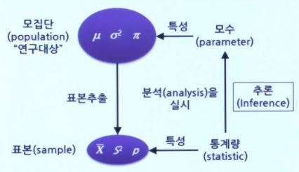

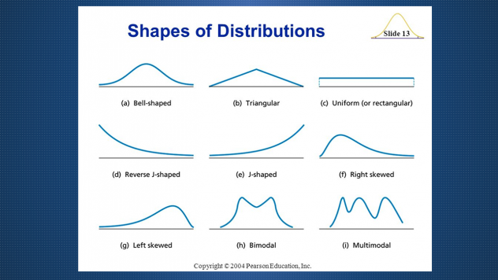

[적률과적률생성함수](https://m.blog.naver.com/PostView.nhn?blogId=mykepzzang&logNo=220846464280&proxyReferer=https%3A%2F%2Fwww.google.co.kr%2F)

[적률생성함수란 쉬운 버전](http://freshrimpsushi.tistory.com/248)


========================================================
## 1-2 이산형 균등분포
<br>

$$ 매개변수  	
{\displaystyle a\in (\dots ,-2,-1,0,1,2,\dots )\,} {\displaystyle b\in (\dots ,-2,-1,0,1,2,\dots )\,} {\displaystyle n=b-a+1\,}$$

$$지지집합	
{\displaystyle k\in \{a,a+1,\dots ,b-1,b\}\,}$$

$$확률 질량	
{\displaystyle {\begin{matrix}{\frac {1}{n}}&{\mbox{for }}a\leq k\leq b\ \\0&{\mbox{otherwise }}\end{matrix}}}$$

$$기댓값	
{\displaystyle {\frac {a+b}{2}}\,}$$

$$중앙값	
{\displaystyle {\frac {a+b}{2}}\,}$$

$$분산	
{\displaystyle {\frac {n^{2}-1}{12}}\,}$$

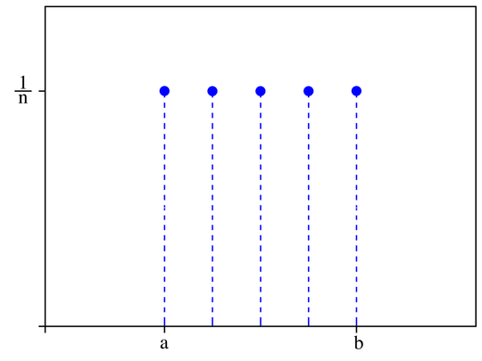 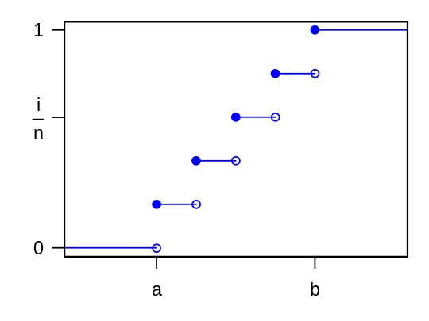


```r
library(extraDistr)
x <- rdunif(100, 0, 10)
x
```

```
  [1]  2 10  5  3  1  1  5  4  2  8  8  3  4  0  4  9  6 10  1  7  3  6  1
 [24]  8  0  3  9  5  6 10  4  4 10  8  5  6  2  8  4  0  6  0  6  0  0  9
 [47]  4  0  6 10  8  9 10  7  6  8 10 10  9  5  8  7  1  8  1  1 10  9 10
 [70]  6  4  0  5  2  9  8  3  6  5  6  8  5  6  8 10 10  5  3  1  5  5 10
 [93] 10  4  7  4  6  2  9  6
```

========================================================
## 1-3 베르누이/이항 분포

### 1-3-1 베르누이 분포
- 베르누이 분포(Bernoulli Distribution)는 확률론과 통계학에서 매 시행마다 오직 두 가지의 가능한 결과만 일어난다고 할 때, 이러한 실험을 1회 시행하여 일어난 두 가지 결과에 의해 그 값이 각각 0과 1로 결정되는 확률변수 X에 대해서

$${\displaystyle P(X=0)=q}, 
{\displaystyle P(X=1)=p}, 
{\displaystyle 0\leq p\leq 1}
, 
{\displaystyle q=1-p}$$

를 만족하는 확률변수 X가 따르는 확률분포를 의미하며, 이항 분포의 특수한 사례에 속한다.

### 1-3-2 이항 분포

[위키피디아 이항분포](https://ko.wikipedia.org/wiki/%EC%9D%B4%ED%95%AD_%EB%B6%84%ED%8F%AC)

- 이항 분포(二項分布)는 연속된 n번의 독립적 시행에서 각 시행이 확률 p를 가질 때의 이산 확률 분포이다. 이러한 시행은 베르누이 시행이라고 불리기도 한다. 사실, n=1일 때 이항 분포는 베르누이 분포이다. 이항 분포는 양봉 분포(Bimodal distribution)와는 다른 것이다.

$$매개변수	
{\displaystyle n\geq 0}
 시행 횟수 (정수)
{\displaystyle 0\leq p\leq 1}
 발생 확률 (실수)
$$

$$확률 질량	
{\displaystyle {n \choose k}p^{k}(1-p)^{n-k}\!}$$

$$누적 분포	
{\displaystyle I_{1-p}(n-\lfloor k\rfloor ,1+\lfloor k\rfloor )\!}$$

$$기댓값	
{\displaystyle np\!}$$

$$분산	
{\displaystyle np(1-p)\!}$$

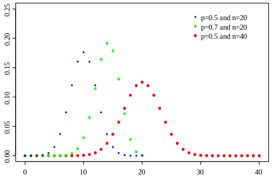 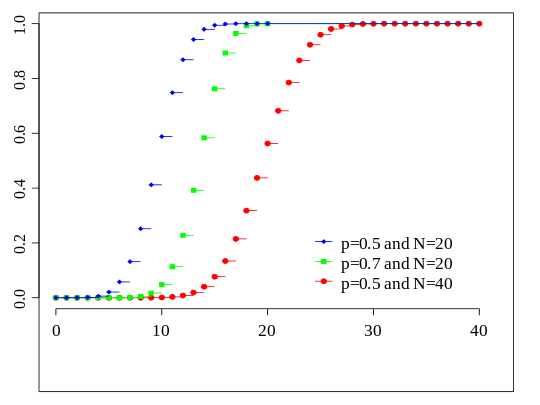

Q. 1,000개의 확률형 아이템을 구매했을 때, 아이템 A를 한 개도 얻지 못 할 확률

```r
dbinom(1, 1000, .001) 
```

```
[1] 0.3680635
```

========================================================
## 1-4 기하분포와 음이항분포

### 1-4-1 기하분포

- 독립적으로 시행되는 베르누이 시행 중 맨 처음 성공이 나올 때까지 반복하는 횟수를 확률변수로 둔 확률분포이다.

- k번째 시행에서 첫 번째 성공이 나올 확률을 계산하기 위해선 처음부터 k-1 번째 시행까지 실패이고 k번째에 시행에서 성공인 확률과 같음을 생각하면 편할 것이다.
따라서 확률질량함수가 위와 같아진다.

$$p(k) = (1-p)^{k-1}p ~,~ k = 1, 2, 3, \cdots \cdots$$


```r
pgeom(1000, prob = .001)
```

```
[1] 0.6326723
```
- 1,000개의 확률형 아이템을 구매해서 아이템 A를 얻을 확률을 계산해보면 약 63%. 

<br>

### 1-4-2 음이항 분포
- 기하분포는 첫 번째 성공이 나올 때 까지의 시행횟수 k에 대한 확률분포라 하면,
음이항 분포는 r번째 성공이 나올 때 까지의 시행횟수 k에 대한 확률분포이다.
따라서 음이항분포는 기하분포의 내용을 조금 더 일반화시킨 것으로 보면 이해가 편하다.

$$p(k) = \binom{k-1}{r-1}(1-p)^{k-r}p^r ~,~ k = r, r+1, r+2, \cdots \cdots$$


```r
pnbinom(1000, 3, .001)  
```

```
[1] 0.08076199
```

- 1,000개의 확률형 아이템을 구매해서 아이템 A를 5개 얻을 확률을 계산해보면 약 8%. 

========================================================
## 1-5 초기하분포

- 총 N개의 샘플은 M개의 원소로 이루어진 그룹1과
N-M개의 원소로 이루어진 그룹2로 구성되어 있다.

- 이때 N개 중 K개를 임의로 선택할 때 그룹1에서 나오는 원소의 수 k에 대한 확률분포를 의미한다.

- 옷장에는 옷이 총 10개가 있는데 상의가 7벌, 하의가 3벌로 이루어져 있다.
이때 내 옷장에서 임의로(simple random sampling) 3개의 옷을 집었을 때 상의가 2벌일 확률을 구하고 싶다면 이때 바로 초기하분포의 확률질량함수를 이용하면 되는 것이다.

$$ p(k) = \frac{\binom{M}{k} \binom{N-M}{K-k}}{\binom{N}{K}} $$

- 초기하분포에서 m→∞, n→∞, m/(m+n)→p이면 이항분포로 수렴한다. 마법 상자가 있어서 무한히 많은 사탕이 들어 있는데 딸기 맛이 60%, 겨자 맛이 40%로 비율이 일정한 경우 그 중 n개를 비복원 추출하는 경우를 생각해 보자. 
- 무한히 사탕이 많으니 비복원 추출로 100개를 뽑으나 1억 개를 뽑으나 사탕 하나를 꺼낼 때 딸기 맛 사탕일 확률은 0.6이다. 

- 그러니까 초기하분포가 모집단의 크기가 엄청나게 크면 이항분포에 가깝게 되는 것이다.


```r
rhyper(10, m = 7, n = 3, k = 3)    
```

```
 [1] 2 2 1 2 2 2 1 2 2 1
```

========================================================
## 1-6 포아송분포
[위키피디아 포아송분포](https://ko.wikipedia.org/wiki/%ED%91%B8%EC%95%84%EC%86%A1_%EB%B6%84%ED%8F%AC)
- 정해진 시간 안에 어떤 사건이 일어날 횟수에 대한 기댓값을 람다라고 했을 때, 그 사건이 n회 일어날 확률은 다음과 같다.


> 1. 어떤 단위구간(예, 1일)동안 이를 더 짧은 작은 단위의 구간(예 : 1시간)로 나눌 수 있고 이러한 더 짧은 단위구간 중에 어떤 사건이 발생할 확률은 전체 척도 중에서 항상 일정해야 한다.

> 2. 두 개 이상의 사건이 동시에 발생할 확률은 0에 가깝다.

> 3. 어떤 단위구간의 사건의 발생은 다른 단위구간의 발생으로부터 독립적이다.

> 4. 특정 구간에서의 사건 발생확률은 그 구간의 크기에 비례한다.

> 5. 푸아송분포 확률 변수의 기댓값과 분산은 모두 λ이다.

$$정의	{\displaystyle f(n;\lambda )={\frac {\lambda ^{n}e^{-\lambda }}{n!}},\,\!}  {\displaystyle \mathrm {Poisson} (\lambda )}$$

$$매개변수	
{\displaystyle \lambda >0}, 지지집합	0 이상의 정수$$

$$누적 분포	
{\displaystyle e^{-\lambda }\sum _{i=0}^{\lfloor k\rfloor }{\frac {\lambda ^{i}}{i!}}={\frac {\Gamma (\lfloor k+1\rfloor ,\lambda )}{\lfloor k\rfloor !}}}

(이때 
{\displaystyle \Gamma (x,y)}
는 불완전 감마 함수, 
{\displaystyle \lfloor x\rfloor }
는 바닥 함수)$$

- 이항분포를 따르는 위와 같은 확률변수 X에서, n이 대단히 크고 p가 대단히 작을 경우, 이 확률변수 X는 λ=np인 푸아송 분포로 근사할 수 있다.

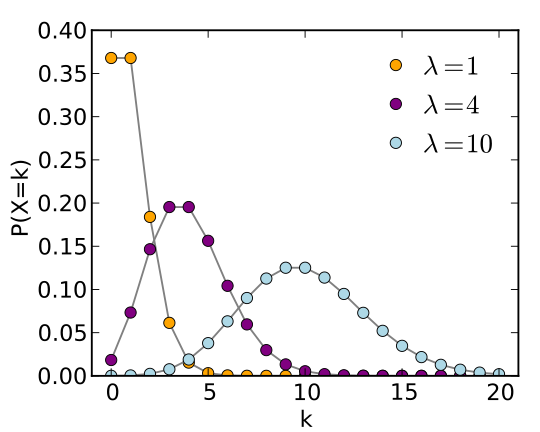 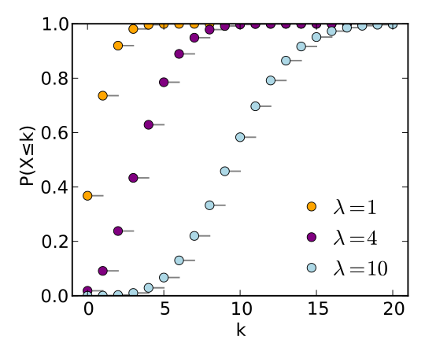

- 어느 은행의 1시간 당 방문 고객 수가 λ = 20 인 포아송 분포를 따른다고 한다.  그럼 1시간 당 방문고객수가 15명일 확률은?


```r
dpois(x=15, lambda = 20)
```

```
[1] 0.05164885
```

========================================================
## 1-7 다항분포
[위키피디아 다항분포](https://ko.wikipedia.org/wiki/%EB%8B%A4%ED%95%AD_%EB%B6%84%ED%8F%AC)

- 다항 분포는 여러 개의 값을 가질 수 있는 독립 확률변수들에 대한 확률분포로, 여러 번의 독립적 시행에서 각각의 값이 특정 횟수가 나타날 확률을 정의한다.

- 다항 분포에서 차원이 2인 경우 이항 분포가 된다

$$기호	
{\displaystyle \mathrm {Multinomial} }$$

$$매개변수	
{\displaystyle n}
: 자연수, 
{\displaystyle (p_{1},\cdots ,p_{n})}
: 합이 1인 양의 실수들$$

$$지지집합
{\displaystyle X_{i}}
: 0부터 n까지의 정수, 
{\displaystyle \sum _{i}X_{i}=n}$$

$$확률 질량	
{\displaystyle {\frac {n!}{x_{1}!\cdots x_{k}!}}p_{1}^{x_{1}}\cdots p_{k}^{x_{k}}}$$

$$기댓값	
{\displaystyle E\{X_{i}\}=np_{i}}$$

$$분산	
{\displaystyle \textstyle {\mathrm {Var} }(X_{i})=np_{i}(1-p_{i})}
$$

|A|B|C|D|E|F|G|H|I|total
|---|---|---|---|---|---|---|---|---|---|
0|7|35|50|112|106|183|208|299|1,000


```r
dmultinom(c(0, 7, 35, 50, 112, 106, 183, 208, 299), prob=c(.001, .005, .034, .05, .1, .12, .19, .2, .3))
```

```
[1] 4.986008e-11
```

|A|B|others|total
|---|---|---|---|
0|7|993|1,000


```r
dmultinom(c(0, 7, 993), prob=c(.001, .005, .994))
```

```
[1] 0.03853889
```

- 즉, 확률형 아이템을 1,000개 구매하여 아이템 A는 0개, 아이템 B는 7개 얻을 확률은 약 3.85%다. 나머지 아이템을 몇 개 얻는지는 큰 관심이 없다.

========================================================
## 1-8 다변량 초기하분포

- 서로 다른 특성 A1, A2, …, Ak를 갖는 품목이 각각 r1, r2, …, rk개씩 들어 있는 용기에서 n개를 추출할 때,  각 특성을 가진 품목이 각각 X1, X2, …, Xk인 확률분포

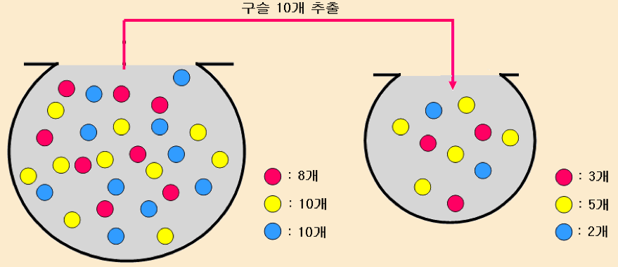

========================================================
## 1-9 감마분포, 지수분포, 카이제곱분포 [1]

[위키피디아 감마분포](https://ko.wikipedia.org/wiki/%EA%B0%90%EB%A7%88_%EB%B6%84%ED%8F%AC)

- 감마 분포는 연속 확률분포로, 두 개의 매개변수를 받으며 양의 실수를 가질 수 있다.

- 감마 분포는 지수 분포나 푸아송 분포 등의 매개변수에 대한 켤레 사전 확률 분포이며, 이에 따라 베이즈 확률론에서 사전 확률 분포로 사용된다.

> 1. 매개변수 k가 정수인 경우 감마 분포는 얼랑 분포가 된다.
> 2. k=1,theta=1/lamda 는 지수 분포가 된다.
> 3. k=nu/2, theta=2는 카이제곱 분포가 된다. 이때 자유도는 nu이다.

$$ f(x) = \frac{\lambda^{\alpha}}{\Gamma(\alpha)}x^{\alpha-1}e^{-\lambda x} ~,~ x \ge 0 $$

$$매개변수	
{\displaystyle k>0\,}
 모양 (실수) ,
{\displaystyle \theta >0\,}
 크기 (실수)$$

$$지지집합	
{\displaystyle x\in [0;\infty )\!}$$

$$확률 밀도	
{\displaystyle x^{k-1}{\frac {\exp \left(-x/\theta \right)}{\Gamma (k)\,\theta ^{k}}}}$$

$$누적 분포	
{\displaystyle {\frac {\gamma (k,x/\theta )}{\Gamma (k)}}}$$

$$기댓값	
{\displaystyle k\theta \,}, 분산	
{\displaystyle k\theta ^{2}\,}$$

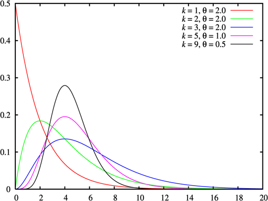 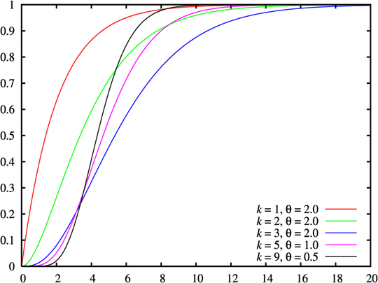

========================================================
## 1-9 감마분포, 지수분포, 카이제곱분포 [2]


```r
dgamma(1, shape = 1, rate = 3)
```

```
[1] 0.1493612
```

[위키피디아 지수분포](https://ko.wikipedia.org/wiki/%EC%A7%80%EC%88%98%EB%B6%84%ED%8F%AC)

- 확률론과 통계학에서, 지수분포(指數分布, 영어: exponential distribution)는 연속 확률 분포의 일종이다. 

- 사건이 서로 독립적일 때, 일정 시간동안 발생하는 사건의 횟수가 푸아송 분포를 따른다면, 다음 사건이 일어날 때까지 대기 시간은 지수분포를 따른다. 

- 이산형 확률분포인 기하분포를 연속형에 적용한 것으로 볼 수 있다.
기하분포는 첫 번째 성공 사건이 일어날 때까지의 시행횟수에 대한 확률분포이면,
지수분포는 첫 번째 성공 사건이 일어날 때까지의 대기시간에 대한 확률분포로 볼 수 있다.

$$기호	
{\displaystyle {\mbox{Exponential(}}\lambda {\mbox{) or Exp(}}\lambda {\mbox{)}}}$$

$$매개변수	
{\displaystyle \lambda >0}
: 빈도$$

$$지지집합	
{\displaystyle x\in [0,\infty )}$$

$$확률 밀도	
{\displaystyle \lambda e^{-\lambda x}}$$

$$누적 분포	
{\displaystyle 1-e^{-\lambda x}}$$

$$기댓값	
{\displaystyle {\frac {1}{\lambda }}}$$

$$분산	
{\displaystyle {\frac {1}{\lambda ^{2}}}}$$

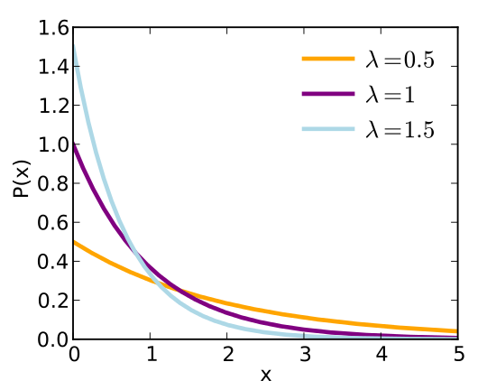 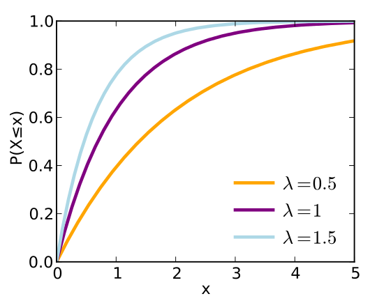


```r
dexp(1, rate = 3)
```

```
[1] 0.1493612
```

========================================================
## 1-9 감마분포, 지수분포, 카이제곱분포 [3]

[위키피디아 카이제곱분포](https://ko.wikipedia.org/wiki/%EC%B9%B4%EC%9D%B4%EC%A0%9C%EA%B3%B1_%EB%B6%84%ED%8F%AC)

- 카이제곱 분포, χ2 분포(χ제곱分布, 영어: chi-squared distribution)는  k개의 서로 독립적인 표준정규 확률변수를 각각 제곱한 다음 합해서 얻어지는 분포이다. 

- 이 때 k를 자유도라고 하며, 카이제곱 분포의 매개변수가 된다. 카이제곱 분포는 신뢰구간이나 가설검정 등의 모델에서 자주 등장한다.

$$매개변수	자연수 
{\displaystyle k}
: 자유도$$
$$지지집합	x ∈ [0, +∞)$$
$$확률 밀도	
{\displaystyle {\frac {1}{2^{k/2}\Gamma (k/2)}}\;x^{k/2-1}e^{-x/2}}$$

$$누적 분포	
{\displaystyle {\frac {1}{\Gamma (k/2)}}\;\gamma (k/2,\,x/2)}$$

$$기댓값	
{\displaystyle k}, 분산	
{\displaystyle 2k}$$

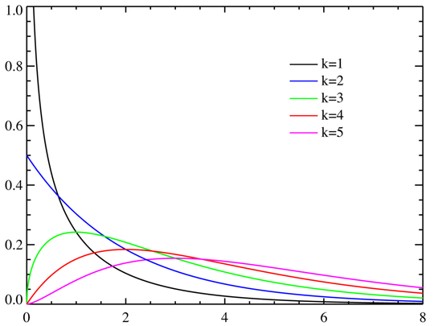 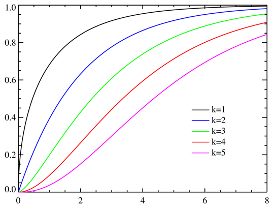


```r
pchisq(2, df = 10)
```

```
[1] 0.003659847
```

```r
x <-  matrix(c(324,371.28,78,79.56,261,212.16), nrow=2, 
      dimnames = list(c("관찰", "기대"), c("제품A", "제품B", "제품C")))

barplot(x, beside = TRUE, legend = TRUE)
```

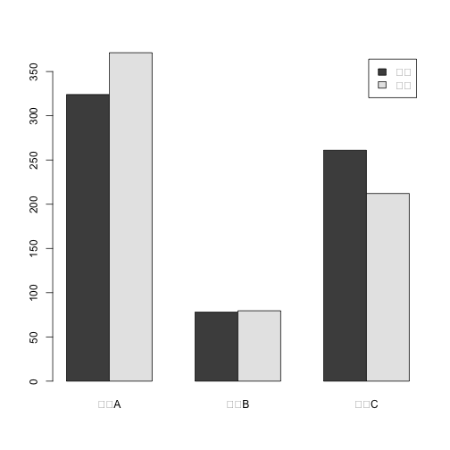

```r
chisq.test(x = x[c(1),], p = c(0.56, 0.12, 0.32))
```

```

	Chi-squared test for given probabilities

data:  x[c(1), ]
X-squared = 17.295, df = 2, p-value = 0.0001756
```

========================================================
## 1-10 베타 분포

[위키피디아 베타분포](https://ko.wikipedia.org/wiki/%EB%B2%A0%ED%83%80_%EB%B6%84%ED%8F%AC)

- 확률론과 통계학에서, 베타 분포(Β分布, 영어: beta distribution)는 두 매개변수 alpha 와 beta에 따라 [0,1] 구간에서 정의되는 연속 확률 분포들의 가족이다

$$f(x) = \frac{\Gamma(\alpha + \beta)}{\Gamma(\alpha) \Gamma(\beta)}x^{\alpha-1}(1-x)^{\beta-1} ~,~ 0 \le x \le 1$$

기호	Beta(α, β)
매개변수	α,β > 0

$$지지집합	
{\displaystyle x\in [0,1]}$$

$$확률 밀도	
{\displaystyle {\frac {x^{\alpha -1}(1-x)^{\beta -1}}{\mathrm {B} (\alpha ,\beta )}}}$$

$$누적 분포	
{\displaystyle I_{x}(\alpha ,\beta )}$$

$$기댓값	
{\displaystyle \operatorname {E} [X]={\frac {\alpha }{\alpha +\beta }}\!}, 

{\displaystyle \operatorname {E} [\ln X]=\psi (\alpha )-\psi (\alpha +\beta )}$$

$$분산	
{\displaystyle \operatorname {var} [X]={\frac {\alpha \beta }{(\alpha +\beta )^{2}(\alpha +\beta +1)}}}
{\displaystyle \operatorname {var} [\ln X]=\psi _{1}(\alpha )-\psi _{1}(\alpha +\beta )}
(폴리감마함수)$$

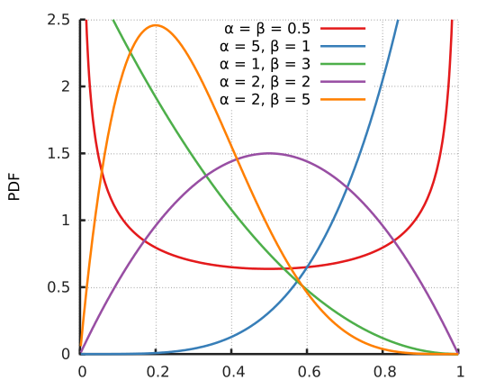 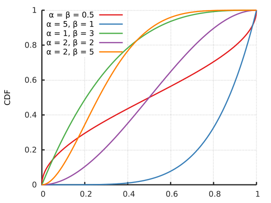


```r
dbeta(.5, shape1 = 2, shape2 = 3)
```

```
[1] 1.5
```

========================================================
## 1-11 정규 분포

[위키피디아 정규분포](https://ko.wikipedia.org/wiki/%EC%A0%95%EA%B7%9C%EB%B6%84%ED%8F%AC)

- 확률론과 통계학에서, 정규분포(正規分布, 영어: normal distribution) 또는 가우스 분포(Gauß分布, 영어: Gaussian distribution)는 연속 확률 분포의 하나이다. 정규분포는 수집된 자료의 분포를 근사하는 데에 자주 사용되며, 이것은 중심극한정리에 의하여 독립적인 확률변수들의 평균은 정규분포에 가까워지는 성질이 있기 때문이다.

- 정규분포는 2개의 매개 변수 평균과 표준편차에 대해 모양이 결정되고, 이때의 분포를 N(mu,sigma)로 표기한다. 특히, 평균이 0이고 표준편차가 1인 정규분포 N (0,1)을 표준정규분포(standard normal distribution)라고 한다.

$$매개변수	
{\displaystyle \mu }$$

$$평균
{\displaystyle \sigma ^{2}>0} 분산 $$

$$지지집합	
{\displaystyle x\in (-\infty ;+\infty )\!}$$

$$확률 밀도	
{\displaystyle {\frac {1}{\sigma {\sqrt {2\pi }}}}\;\exp \left(-{\frac {\left(x-\mu \right)^{2}}{2\sigma ^{2}}}\right)\!}$$

$$누적 분포	
{\displaystyle {\frac {1}{2}}\left(1+\mathrm {erf} \,{\frac {x-\mu }{\sigma {\sqrt {2}}}}\right)\!}$$

$$기댓값	
{\displaystyle \mu }$$
 
$$분산	
{\displaystyle \sigma ^{2}}$$

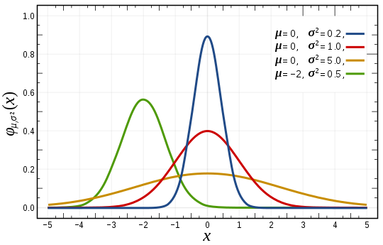 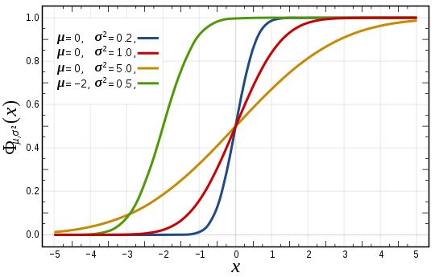


```r
dnorm(0, mean = 0, sd = 1)
```

```
[1] 0.3989423
```

